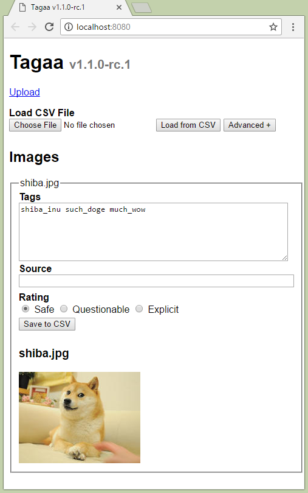

# local-tagger
User interface for the 'Bulk Add CSV' extension of Shimmie2.

local-tagger will launch a web interface in a new browser window, which
allows to add tags, source and rating on each image that is contained in the
current directory (or the one specified by the -dir option). Subfolders are
ignored. Supported types: "gif", "jpeg", "jpg", "png", "swf"

The web interface allows to save the image metadata in a CSV file as expected
by the 'Bulk Add CSV' Shimmie2 extension. If a CSV file with the name
'bulk.csv' (or a name specified by the -csv option) is found, it will be
loaded automatically on start up.

The folder containing the CSV file and the images can then be manually
uploaded to the server and used by the 'Bulk Add CSV' extension to bulk add
the images to Shimmie2.

## Usage
* Download the latest [release](https://github.com/kusubooru/local-tagger/releases) for your system and extract.
* Place the executable into a folder with images and launch.
* Tag your images.
* Make sure to fill the 'server path prefix' input with the upload location on
  your server and then click 'Save to CSV'.

### Screenshot



### Command Line Options
```sh-session
	$ ./local-tagger
```
With the default options, local-tagger will:

1. Search for images in the current directory.
2. Try to load ./bulk.csv and if it doesn't exist it will create it.
3. Start a new server at http://localhost:8080 and then launch a browser window
   to that address.

```sh-session
	$ ./local-tagger -dir ~/myfolder -csv mybulk.csv -port 8888
```
With the above options, local-tagger will:

1. Search for images under ~/myfolder.
2. Try to load ~/myfolder/mybulk.csv and if it doesn't exist it will create it.
3. Start a new server at http://localhost:8888 and then launch a browser window
   to that address.
